# Modern Hotel Network: Full-Stack Infrastructure Design & Implementation

This project is a comprehensive networking solution for a three-story modern hotel. It implements a hierarchical network design featuring departmental VLAN segmentation, dynamic routing with OSPF, secure remote management via SSH, and hardened Layer 2 port security.

## 🏨 Project Overview & Requirements
The goal of this project was to design a network where three distinct floors communicate via a central server room. 

### Core Specifications:
* **Inter-Router Links:** Serial DCE cables connecting three 2911 routers.
* **Network Backbone:** `10.10.10.0/30`, `10.10.10.4/30`, `10.10.10.8/30`.
* **Routing Protocol:** OSPF (Open Shortest Path First) for global reachability.
* **Departmental VLANs:** 8 distinct VLANs across 3 floors (VLAN 10 through 80).
* **IP Management:** Router-based DHCP server for all departments.
* **Security:** SSH for remote login and Sticky MAC Port Security in the IT Dept.

---

## 🗺️ Master Network Topology
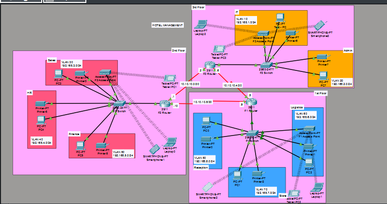
*Figure 1: Complete architecture featuring three routers, departmental switches, and integrated wireless access points.*

---

## 🛠️ Step-by-Step Configuration & Evidence

Below is the complete documentation of every configuration phase. Click each section to view the technical implementation and screenshots.

<b>Phase 1: Basic Router Connectivity & Interface Setup</b>

The routers are the heart of the system, connected via Serial DCE cables. All interfaces were manually enabled and assigned IPs based on the 10.10.10.x/30 backbone.

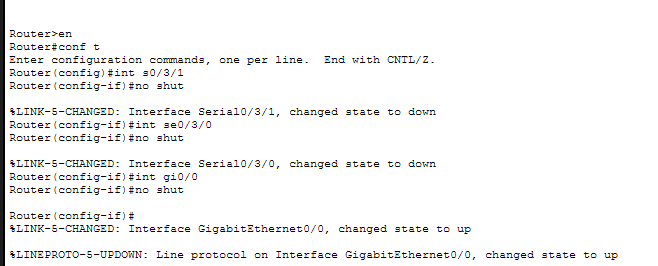
 

 
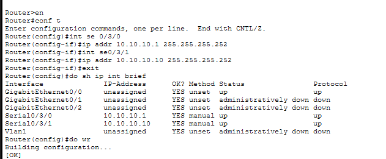
 
*Verification: CLI output showing Gigabit and Serial interfaces in an 'up/up' state.*

<b>Phase 2: VLAN Design & Inter-VLAN Routing</b>

To meet the requirement of 8 departments, I used "Router-on-a-Stick." Each department (Reception, Finance, IT, etc.) was assigned a specific VLAN ID and sub-interface.

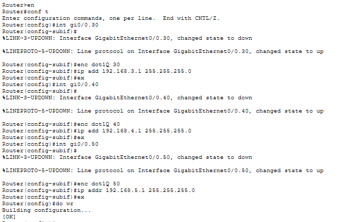
 
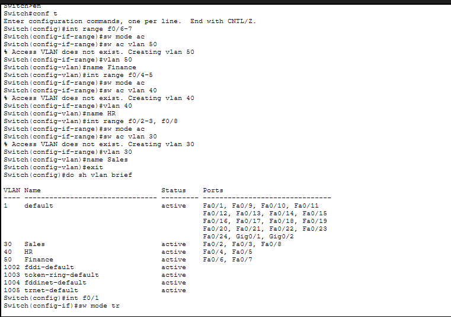
 
*Details: Encapsulation dot1Q was applied to each sub-interface to map VLAN IDs to their respective network gateways.*

<b>Phase 3: Dynamic IP Assignment (DHCP)</b>

I configured DHCP pools on each router so that every laptop, PC, and smartphone receives an IP automatically.

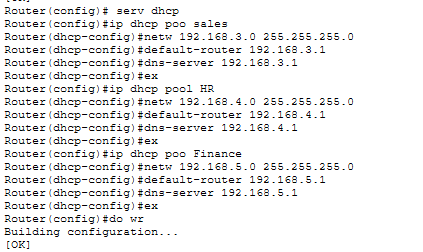
 
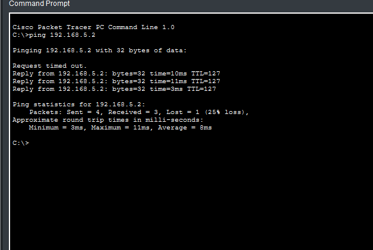
 
*Action: Verification of a PC successfully obtaining an IP, Subnet Mask, and Gateway from the router pool.*
 
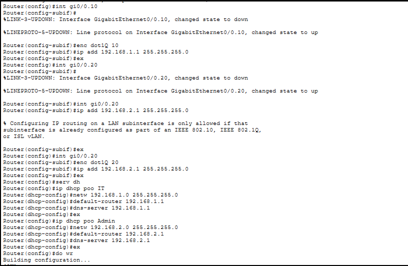
 
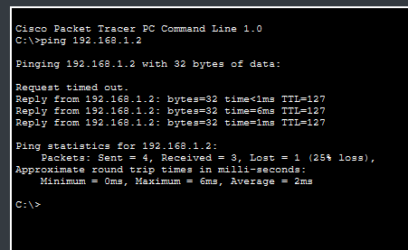
 
*Action: The Internal VLAN Routing and DHCP configured togather on the router and tested along with ping*
 
*Note: to configure the inter-VLAN routing, we require to create a sub-interface along with assigning a  VLAN number and the IP address to be assigned, which acts as a default gateway.*

<b>Phase 4: OSPF Dynamic Routing Protocol</b>

OSPF was configured on all three routers to advertise departmental networks. This ensures that a PC on the 1st floor can find the shortest path to a server on the 3rd floor.

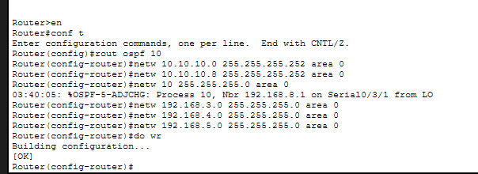
 
*Result: Here by configuring the OSPF on all Routers we can connect 1 PC of 1 floor to another PC of ANother FLoor.*
*NOTE: to configure OSPF we need to set network range , default gateway, dns-server per pool. In this case we set network range as 192.168.8.0 - 255.255.255.0 , default gateway as 192.168.8.1, dns-server as 192.168.8.1 for pool of reception.*

<b>Phase 5: Wireless Infrastructure (Laptops & Mobile)</b>

Each floor features high-speed Wi-Fi. Access points were configured with unique SSIDs and WPA2-PSK encryption.

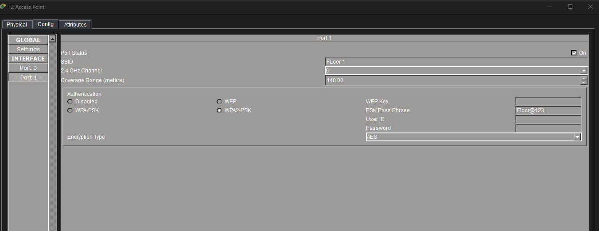
 
*Note: here we click on Port 1 and configure the SSID with password by selecting the WPA2-PSK.*
 
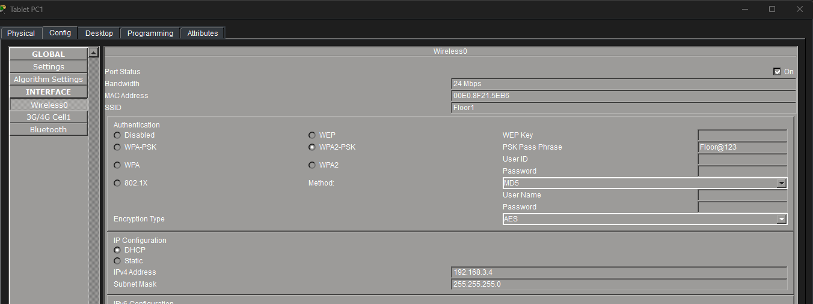
 
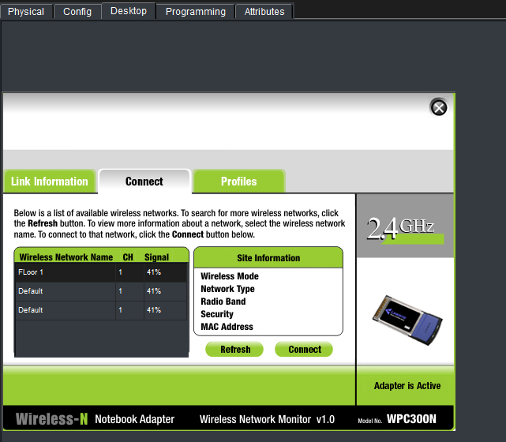
 
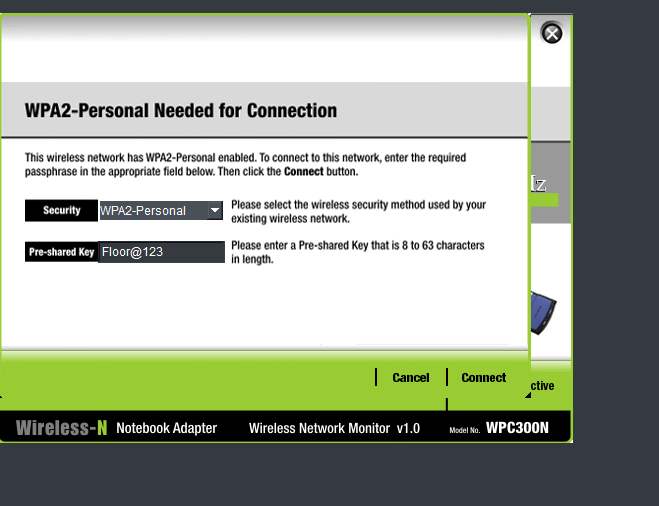
*Note: here we clivk on Desktop then to PC Wireless where we select our WIFI network configured during Access Point and enter the password.
 
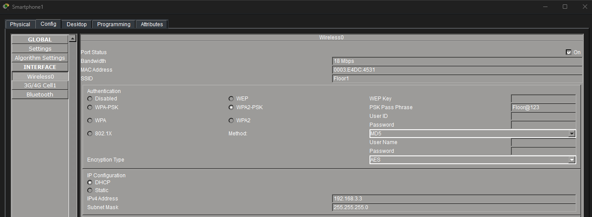
 
*Process: Manually entering the SSID and WPA2-PSK password on smartphones and tablets to establish connectivity.*

<b>Phase 6: Secure Remote Management (SSH)</b>

Remote access is secured via SSH using the username `itech` and password `itech`. This allows IT staff to manage routers from any floor.

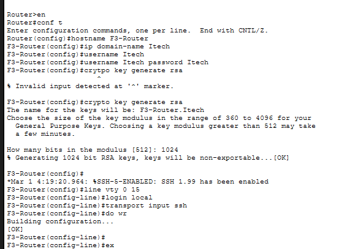
 
*Note: for configuring SSH we require Domain-name , username and password here in this case we configure domain name , password and username as Itech and we use RSA for cryptographic encryption.*
 
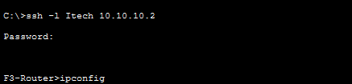
 
*Evidence: Command prompt showing a successful remote login to the FLOR2 Router from a Test-PC.*

<b>Phase 7: IT Department Port Security</b>

To prevent unauthorized devices from plugging into the IT network, Port Security was enabled on `fa0/1`.
* **Mode:** Sticky (learns the MAC automatically).
* **Violation:** Shutdown (disables the port if an intruder connects).

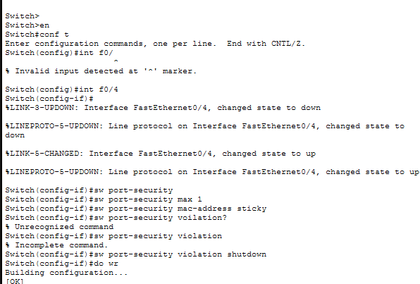
 
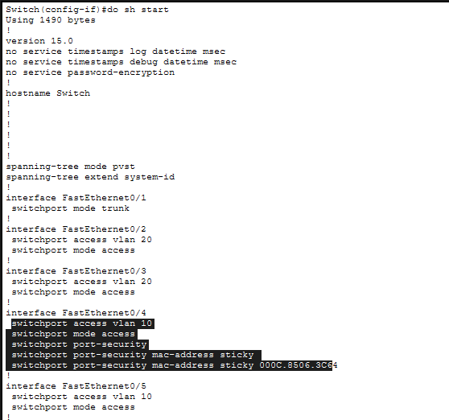
 

 |
*Verification: Using 'do show port-security' to confirm the Test-PC is the only allowed device.*

<b>Phase 8: Running Configuration & Startup</b>

The final `show running-config` confirms that all protocols (OSPF, SSH, Port-Security) are saved and active.

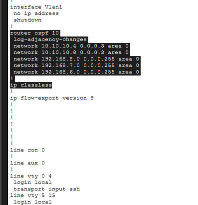
 
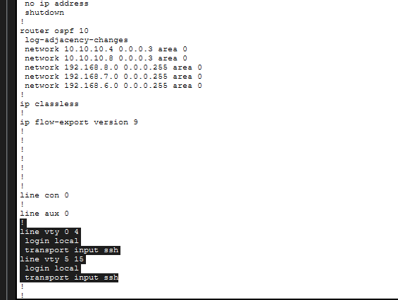
 
*Summary: Comprehensive view of the startup-config settings.*

---

## 🧪 Testing & Connectivity Results

### Departmental Reachability
I performed pings between the 1st Floor (Reception) and the 3rd Floor (IT) to verify that OSPF and Inter-VLAN routing are working perfectly.

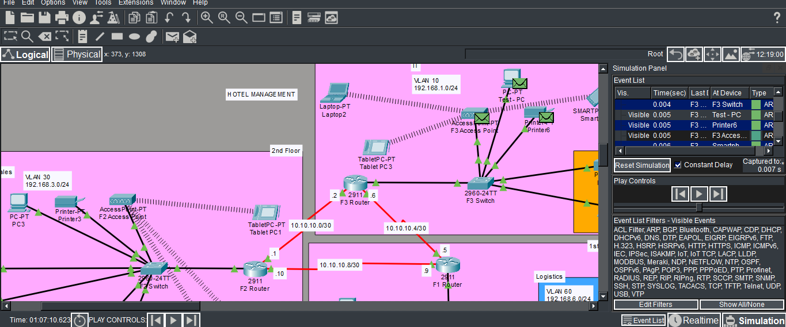
*Status: 0% Packet Loss – Success!*

---

## 🎥 Video Demonstration
The following video provides a complete walkthrough of the network, showing real-time pings, the SSH login process, and wireless device connections.

[Click to Watch the Full Hotel Network Walkthrough](./hotel_media/demo_video.mp4)

---

## 📝 Project Identity
* **Lead Engineer:** Sneha
* **Location:** Kalburgi
* **Project Date:** May 2026
* **Environment:** Cisco Packet Tracer 8.x
