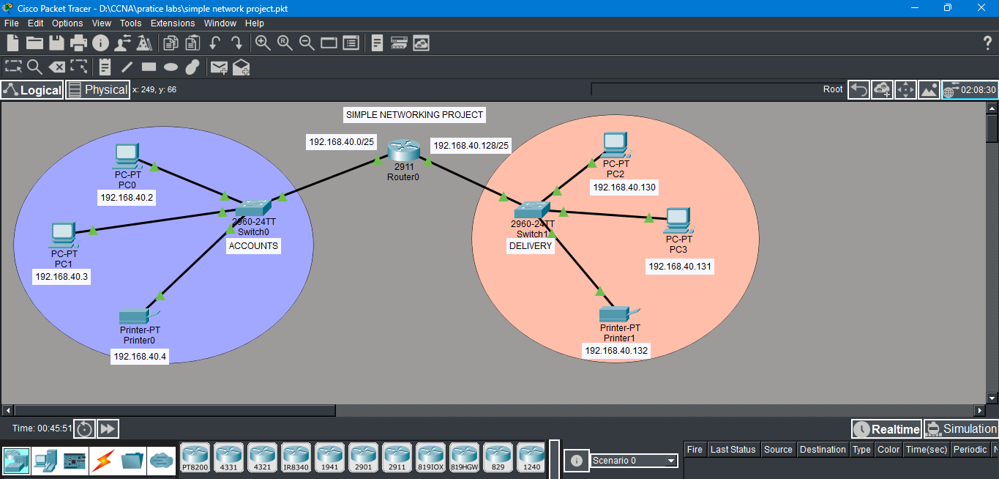
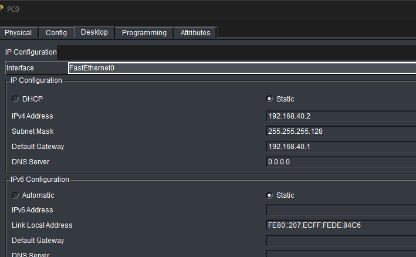

# Inter-Departmental Network Connectivity via Subnetting

This project demonstrates the design and implementation of a segmented network for two distinct departments—**ACCOUNTS** and **DELIVERY**—using Cisco Packet Tracer. By utilizing **Variable Length Subnet Masking (VLSM)**, a single Class C address space is partitioned into two logical subnets, ensuring efficient IP address management and broadcast isolation.

## Project Overview
The objective was to create a functional network topology where devices in the **DELIVERY** department can successfully communicate with devices in the **ACCOUNTS** department through a central router. 

### Key Technical Features:
* **Subnetting:** Segmenting the `192.168.40.0` network using a `/25` mask.
* **Routing:** Implementing inter-subnet routing via a Cisco 2911 Router.
* **Endpoints:** Configuring static IP addresses, masks, and gateways for PCs and Printers in each department.
* **Verification:** Successful ICMP (ping) tests between departments in both Realtime and Simulation modes.

---

## Network Topology

*Description: The logical topology showing the ACCOUNTS department (Blue) and DELIVERY department (Orange) connected via Router0.*

---

## Subnetting Scheme
Based on the project requirements, the `192.168.40.0` network was divided into two equal subnets using the mask `255.255.255.128`:

| Department | Network ID | Valid Host Range | Broadcast ID | Gateway |
| :--- | :--- | :--- | :--- | :--- |
| **ACCOUNTS** | `192.168.40.0` | `.1` to `.126` | `192.168.40.127` | `192.168.40.1` |
| **DELIVERY** | `192.168.40.128` | `.129` to `.254` | `192.168.40.255` | `192.168.40.129` |

---

## Configuration Steps

### 1. Router Interface Configuration
The Cisco 2911 Router was configured to act as the default gateway for both subnets.

 

*Description: CLI commands showing the assignment of IP addresses to GigabitEthernet 0/0 and 0/1 and bringing the interfaces up using the 'no shut' command.*

### 2. End Device IP Assignment
Each PC and Printer was manually assigned a static IP address according to its respective departmental subnet.

*Description: Static IPv4 configuration on a PC in the DELIVERY department showing the IP, Subnet Mask, and Default Gateway.*

---

## Testing and Verification

### Simulation Mode Analysis
Using the Simulation Panel, the flow of ICMP and ARP packets was traced to ensure the router correctly handled the traffic between subnets.

*Description: The Event List confirms the successful transmission of ICMP packets from the DELIVERY department to the ACCOUNTS department.*

### Demonstration Video
[Watch the Project Walkthrough](./images/simple_project.mp4)
*Description: A video demonstration showing the step-by-step configuration, CLI execution, and a successful final ping test.*

---

## Project Metadata
* **Project Name:** Simple Networking Project - Departmental Connectivity
* **Tools Used:** Cisco Packet Tracer, VLSM Calculator
* **Target Achievement:** Successful Inter-Subnet Communication
