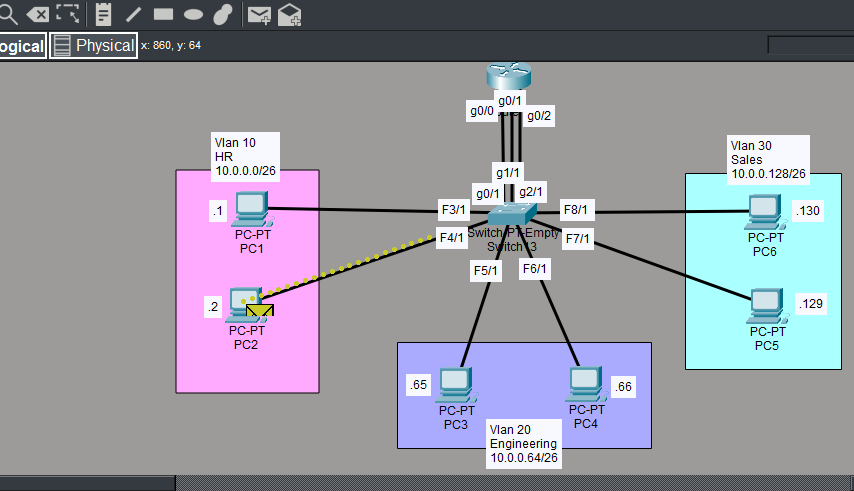
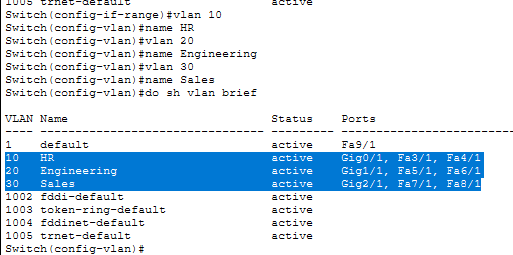
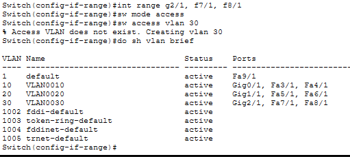
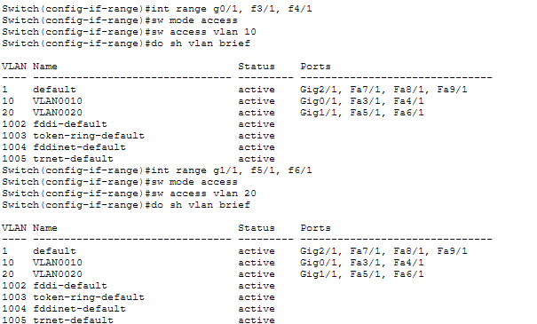
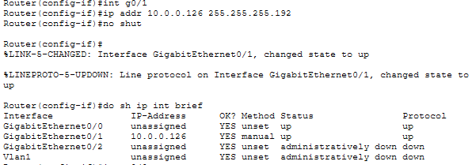
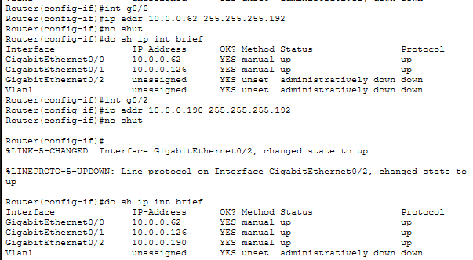
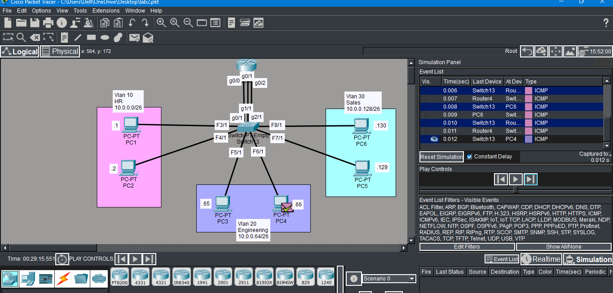
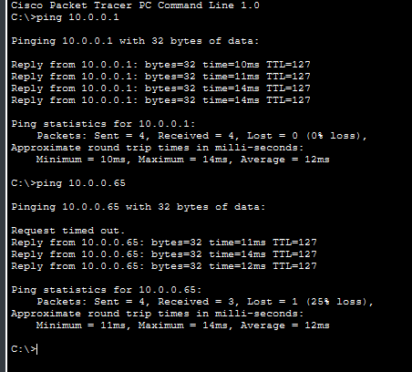

# Lab 01 — VLANs + Router-on-a-Stick (Inter-VLAN Routing)

## Objective
Simulate a company network with three departments (HR, Engineering, Sales)
isolated in separate VLANs, with inter-VLAN routing via a router.

## Topology

## Network Design
| VLAN | Department | Subnet | Range |
|------|------------|--------|-------|
| VLAN 10 | HR | 10.0.0.0/26 | .1 – .62 |
| VLAN 20 | Engineering | 10.0.0.64/26 | .65 – .126 |
| VLAN 30 | Sales | 10.0.0.128/26 | .129 – .190 |

## Devices
- 1 x Cisco Router (Router-on-a-Stick)
- 1 x Layer 2 Switch (Switch3)
- 6 x PCs (2 per VLAN)

## What I Configured

**On the Switch:**
- Created VLANs 10, 20, 30 with names
- Assigned access ports to each VLAN
- Configured trunk link to router

**On the Router:**
- Configured 3 subinterfaces (g0/0, g0/1, g0/2)
- Assigned gateway IPs for each VLAN subnet

## Verification Screenshots

### VLAN Assignment (show vlan brief)

### Router Interfaces (show ip int brief)

### Simulation Mode — Packet Flow

### Cross-VLAN Ping Test

## Network in Action 🎬

> **Note:** Due to the high resolution and detail of the simulation, the full demonstration video and GIF are available as files within this repository. 

To see the step-by-step packet flow and inter-VLAN routing in action:
1. Navigate to the `/screenshots` folder (or the root directory).
2. Download and open **`simulation.mp4`**.

The demonstration shows an ICMP ping traveling from the **HR VLAN** through the router into the **Engineering VLAN**, captured in Packet Tracer's simulation mode and performed other configuration as well. This visualization clearly demonstrates why a Layer 3 device (the router) is essential for inter-VLAN communication.

## Key Learnings
- VLANs segment a network at Layer 2 — different VLANs cannot communicate without a router
- Router-on-a-Stick uses one physical interface with multiple subinterfaces for routing between VLANs
- Trunk ports carry traffic for multiple VLANs between switches and routers
- /26 subnetting gives 62 usable hosts per subnet — right-sized for small departments
- Used simulation mode to visually trace ICMP packets hopping through the router
