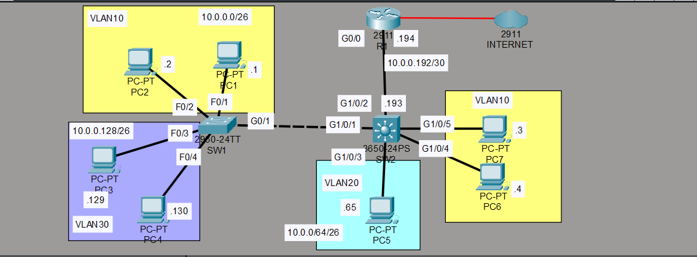
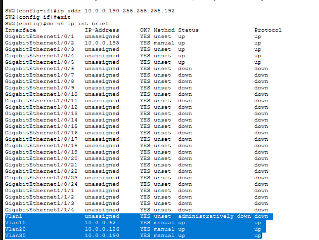
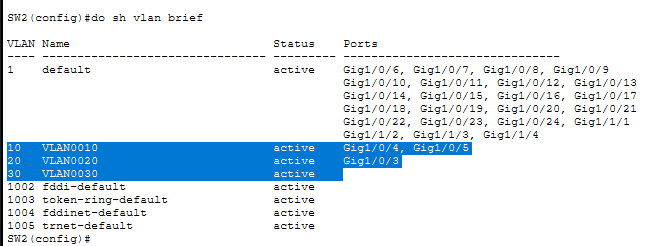
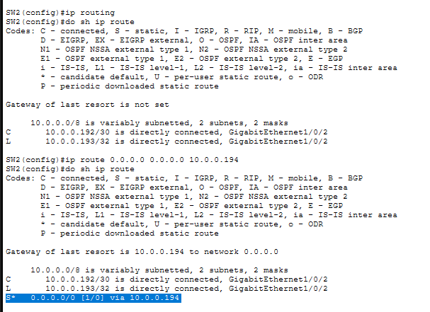
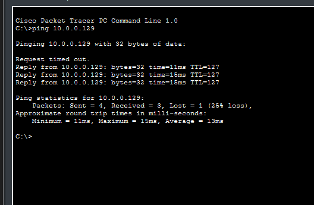
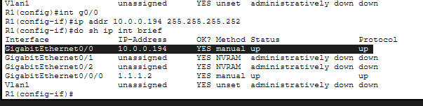

# Lab 02 — Inter-VLAN Routing via Multilayer Switch (Migration from ROAS)

## Objective
Migrate an existing Router-on-a-Stick (ROAS) inter-VLAN routing setup
to a more scalable multilayer switch (Layer 3 switch) architecture.
Verify that inter-VLAN traffic is now routed by SW2, not R1.

## Topology


## Network Design
| VLAN | Department  | Subnet         | SVI Gateway  |
|------|-------------|----------------|--------------|
| 10   | HR          | 10.0.0.0/26    | 10.0.0.62    |
| 20   | Engineering | 10.0.0.64/26   | 10.0.0.126   |
| 30   | Sales       | 10.0.0.128/26  | 10.0.0.190   |

## Devices
- 1 x Cisco 2911 Router (R1) — internet gateway only
- 7 x PCs across 3 VLANs
- 1 x Cisco 2950-24TT Switch (SW1) — access layer
- 1 x Cisco 3650-24PS Multilayer Switch (SW2) — inter-VLAN routing

## What I Configured

### Step 1 — Removed ROAS from R1
Deleted subinterfaces g0/0.10, g0/0.20, g0/0.30 from R1.
Assigned a plain IP (10.0.0.194) to g0/0 for WAN connectivity only.

### Step 2 — Converted SW2 uplink to Layer 3
Used `no switchport` on G1/0/2 to convert it from a Layer 2
trunk port to a routed Layer 3 interface.
Assigned IP 10.0.0.193/30 — point-to-point link between SW2 and R1.

### Step 3 — Enabled IP routing on SW2
```
SW2(config)# ip routing
```
This single command turns the multilayer switch into a router.

### Step 4 — Configured SVIs for each VLAN
```
SW2(config)# int vlan 10
SW2(config-if)# ip addr 10.0.0.62 255.255.255.192

SW2(config)# int vlan 20
SW2(config-if)# ip addr 10.0.0.126 255.255.255.192

SW2(config)# int vlan 30
SW2(config-if)# ip addr 10.0.0.190 255.255.255.192
```

### Step 5 — Added default route on SW2
```
SW2(config)# ip route 0.0.0.0 0.0.0.0 10.0.0.194
```
All unknown traffic (internet-bound) forwards to R1.

## Verification Screenshots

### Topology


### SVIs confirmed up (show ip int brief)


### VLAN assignment (show vlan brief)


### Default route confirmed (show ip route)


### Cross-VLAN ping test


### SW2 running config — interface config


## ROAS vs Multilayer Switch — Key Difference
| Feature | ROAS (Lab 01) | Multilayer Switch (Lab 02) |
|---------|--------------|--------------------------|
| Routing done by | Router | Layer 3 Switch |
| Scalability | Limited | High |
| Single point congestion | Yes (one physical link) | No |
| Used in | Small networks | Enterprise networks |

## Simulation Video
> To see the live packet simulation, download the video file:
[Click here to watch simulation](screenshots/simulation.mp4)

## Key Learnings
- `no switchport` converts a Layer 2 switch port to a routed port
- `ip routing` must be enabled on a multilayer switch for SVIs (Switched Virtual Interface) to route
- SVIs act as the default gateway for each VLAN — no router needed
- A default route on SW2 sends internet traffic upstream to R1
- Traffic between VLANs never touches R1 — SW2 handles it entirely
- Verified using simulation mode that ICMP packets route through SW2

